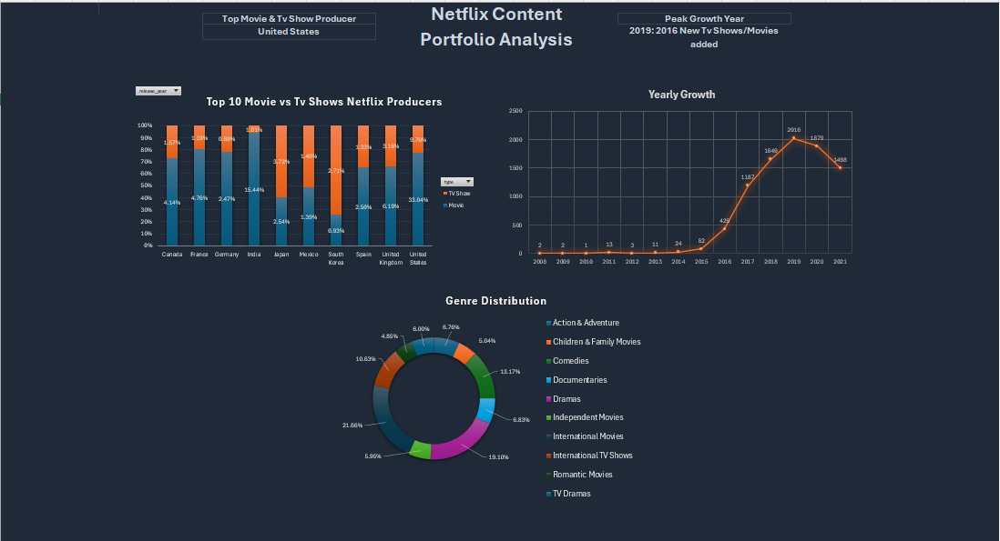

# 📊 Netflix Content Portfolio Analysis (Excel)

## 🎯 Descripción del Proyecto
Este proyecto es un dashboard interactivo de Business Intelligence desarrollado íntegramente en Microsoft Excel. Su objetivo principal es analizar el crecimiento histórico, la distribución geográfica y las preferencias de contenido del catálogo de Netflix para entender las tendencias estratégicas de la plataforma.

## 🛠️ Herramientas y Habilidades Demostradas
* Power Query: Limpieza, transformación de datos y extracción de fechas (`date_added`).
* Modelado de Datos: Creación de tablas dinámicas auxiliares para estructurar las métricas.
* Visualización de Datos: Diseño de un dashboard corporativo con gráficos de barras apiladas al 100%, líneas de tendencia temporal y gráficos de anillos.
* Interactividad: Uso de segmentadores de datos conectados de forma global.

## 📈 Vista Previa del Dashboard

## 🔍 Hallazgos Principales
* Dominio Geográfico: Estados Unidos lidera de forma absoluta el volumen de producción tanto en películas como en series.
* Crecimiento Exponencial: A través del análisis de fechas de incorporación (`date_added`), se identifica que el pico de expansión de contenido de la plataforma ocurrió en el año 2019.
* Preferencias de Contenido: Los géneros de dramas e internacionales dominan el peso porcentual del catálogo general.

## 📁 ¿Cómo ver el archivo?
Puedes descargar el archivo completo **[Netflix-Content-Portfolio-Analysis](./Netflix-Content-Portfolio-Analysis.xlsx)** desde este repositorio y abrirlo en Excel para interactuar con los filtros y tablas dinámicas.
